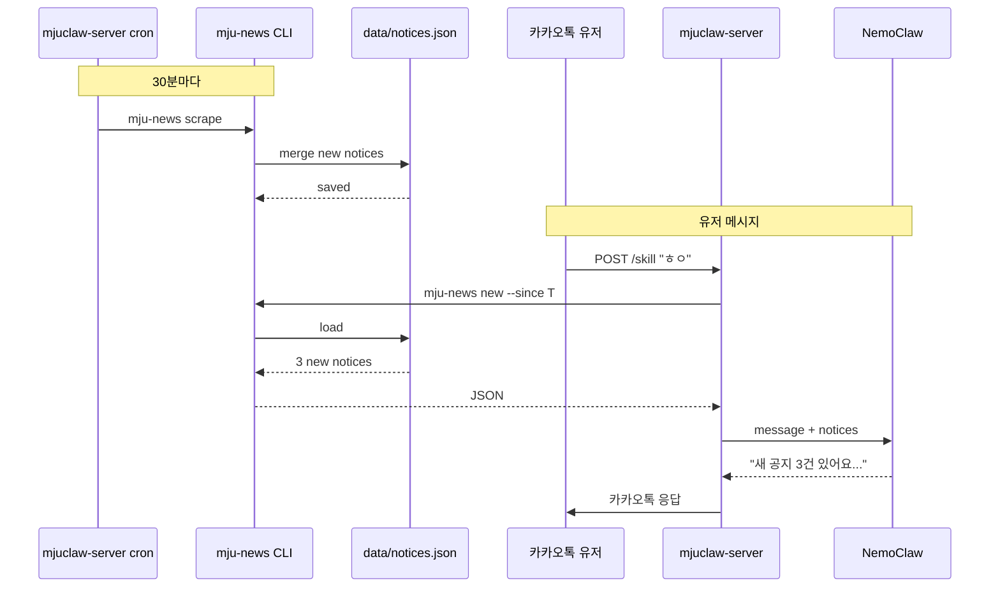

# mju-news 프로젝트 명세서

> **이 문서의 목적**: 이 문서 하나만으로 `mju-news` 레포를 처음부터 완전히 구축할 수 있도록 작성된 자기완결적(self-contained) 명세서입니다. 새 Claude Code 세션에서 이 문서를 참고하여 전체 프로젝트를 구현할 수 있어야 합니다.
>
> **최종 수정**: 2026-04-08
> **대상 독자**: Claude Code (implementer), 사람 개발자 (reviewer)

---

## 목차

1. [프로젝트 개요](#1-프로젝트-개요)
2. [목표 및 비목표](#2-목표-및-비목표)
3. [생태계 컨텍스트](#3-생태계-컨텍스트)
4. [아키텍처](#4-아키텍처)
5. [기술 스택](#5-기술-스택)
6. [프로젝트 구조](#6-프로젝트-구조)
7. [CLI 명세](#7-cli-명세)
8. [스크래퍼 모듈 상세](#8-스크래퍼-모듈-상세)
9. [데이터 스키마](#9-데이터-스키마)
10. [저장소 전략](#10-저장소-전략)
11. [Agent Skill 명세](#11-agent-skill-명세)
12. [mjuclaw-server 통합](#12-mjuclaw-server-통합)
13. [빌드, 설치, 실행](#13-빌드-설치-실행)
14. [테스트 전략](#14-테스트-전략)
15. [오류 처리 및 안정성](#15-오류-처리-및-안정성)
16. [보안 고려사항](#16-보안-고려사항)
17. [향후 확장 로드맵](#17-향후-확장-로드맵)
18. [체크리스트](#18-체크리스트)
19. [참고 자료](#19-참고-자료)

---

## 1. 프로젝트 개요

### 1.1 한 줄 설명

명지대학교의 공개 학사/장학/학과 공지사항을 스크래핑하여 CLI 명령어와 Claude Agent Skill로 제공하는 독립 실행 도구.

### 1.2 왜 필요한가

MJUClaw (카카오톡 챗봇)는 "학교 소식을 먼저 알려줘" 같은 선제적 알림 기능이 필요하다. 카카오 비즈메시지 API는 사업자 등록이 필요해서 개인 개발자는 사용 불가. 대안으로 **Pull 방식** — 유저가 메시지 보낼 때 쌓여있던 새 공지를 같이 전달하는 구조가 필요하다.

이를 위해:
1. 백그라운드에서 학교 공지를 주기적으로 스크래핑
2. 로컬에 저장 (DB 또는 파일)
3. 유저 메시지 처리 시 새 공지 포함

이 스크래퍼는 `mjuclaw-server`와 분리된 **독립 레포**로 만든다. 이유:
- 재사용성 (다른 프로젝트에서도 쓸 수 있음)
- 독립적 버전 관리
- `mju-cli`와 동일한 철학 (서비스별 분리)
- 샌드박스 재생성 시 플러그인처럼 재설치 가능

### 1.3 관련 레포

- **[mjuclaw-server](https://github.com/university-claw/mjuclaw-server)** — 카카오톡 브릿지 서버 (consumer)
- **[mju-cli](https://github.com/nullhyeon/mju-cli)** — 명지대 CLI (자매 프로젝트, SSO 필요한 개인 데이터용)
- **mju-news** (이 레포) — 공개 공지 스크래퍼 (신규)

---

## 2. 목표 및 비목표

### 2.1 목표 (Goals)

1. **공개 공지만 다룸** — 로그인 없이 접근 가능한 명지대 웹페이지만 스크래핑
2. **CLI로 실행 가능** — `mju-news scrape`, `mju-news list`, `mju-news new` 같은 명령어
3. **JSON 출력 기본** — 파이프라인 친화적, `mjuclaw-server`가 파싱 용이
4. **Agent Skill 제공** — NemoClaw/Claude 에이전트가 자율적으로 호출 가능
5. **증분 감지** — 마지막 스크랩 이후 새로 올라온 공지만 필터링 가능
6. **저사양 동작** — cron으로 30분마다 돌아도 부담 없을 만큼 가벼움

### 2.2 비목표 (Non-Goals)

1. **개인 데이터 조회** — LMS 성적, 출석 등은 `mju-cli`가 담당. 이 도구는 공개 데이터만.
2. **실시간 푸시** — 카카오톡 푸시는 기술적으로 불가. Pull 방식 전제.
3. **유저 관리** — 유저별 알림 구독/필터링은 `mjuclaw-server`에서 처리.
4. **UI 제공** — CLI와 API(JSON)만. 웹 UI 없음.
5. **DB 직접 연결** — 1.0에서는 파일 기반 저장. PostgreSQL 등은 consumer 쪽에서.

### 2.3 성공 기준

- [ ] `mju-news scrape --format json`을 CI에서 5초 이내 완료
- [ ] 첫 스크랩 후 두 번째 스크랩 시 중복 제거 정확도 100%
- [ ] NemoClaw 샌드박스에서 SKILL.md 기반으로 자율 호출 성공
- [ ] `mjuclaw-server`가 cron으로 연동 후 1주일 무장애 운영

---

## 3. 생태계 컨텍스트

### 3.1 전체 시스템 다이어그램

```
┌─────────────────────────────────────────────────────────────┐
│                       HOST (로컬 머신)                        │
│                                                             │
│  ┌───────────────┐    ┌─────────────────┐                  │
│  │  mju-news     │    │  mjuclaw-server │                  │
│  │  (this repo)  │◀───│  cron (30분)    │                  │
│  │               │    │                 │                  │
│  │  - scrapers   │    │  - POST /skill  │                  │
│  │  - cli        │    │  - /view/:id    │                  │
│  │  - storage    │    │  - /api/news    │                  │
│  └──────┬────────┘    └────────┬────────┘                  │
│         │                      │                           │
│         │ 스크랩                │ HTTPS                     │
│         ▼                      │                           │
│  ┌──────────────┐               │                           │
│  │ mju.ac.kr    │               │                           │
│  │ (공개 사이트) │               │                           │
│  └──────────────┘               │                           │
│                                 │                           │
└─────────────────────────────────┼───────────────────────────┘
                                  │
                     ngrok tunnel (고정 도메인)
                                  │
                     ┌────────────┴─────────────┐
                     │                          │
                     ▼                          ▼
        ┌─────────────────────┐    ┌─────────────────────┐
        │  카카오톡 유저        │    │  NemoClaw 샌드박스    │
        │  (POST /skill)      │    │  (openclaw agent)   │
        │                     │    │                     │
        │  → 메시지 처리 시    │    │  → SKILL.md 로드    │
        │    새 공지 포함      │    │  → ngrok API 호출   │
        └─────────────────────┘    └─────────────────────┘
```

### 3.2 핵심 제약 이해

**제약 1: 샌드박스 네트워크 격리**
- NemoClaw 샌드박스는 `10.200.0.1:3128` HTTPS 프록시를 통해서만 외부 접근 가능
- 호스트의 임의 포트(예: `localhost:3000`)에 직접 접근 불가
- **해결**: ngrok 고정 도메인 (`histographic-numerally-miguel.ngrok-free.dev`)을 통해 HTTPS로 우회

**제약 2: 카카오톡 능동 푸시 불가**
- 카카오 Event API는 사업자 등록증 필요 (개인 개발자 불가)
- **해결**: Pull 방식 — 유저 메시지 처리 중에 새 공지 조회 및 포함

**제약 3: 샌드박스 재생성 시 상태 소실**
- `nemoclaw onboard` 실행 시 workspace 내 설정 전부 초기화
- **해결**: SKILL.md 파일을 mju-news 레포에서 관리하고, `start.sh`로 자동 재설치

### 3.3 데이터 흐름

**스크랩 → 저장 → 조회의 흐름**:

```
1. cron (호스트에서 30분마다)
   └── `mju-news scrape`
       └── 각 스크래퍼가 HTML 페이지 fetch
           └── cheerio로 파싱
               └── 신규 항목만 필터링 (기존 ID 비교)
                   └── `data/notices.json`에 append

2. mjuclaw-server 유저 메시지 처리 시
   └── `mju-news new --since=<timestamp> --format json`
       └── 해당 유저에게 새 공지 있으면 응답에 포함

3. NemoClaw 에이전트가 필요 시
   └── SKILL.md 지시에 따라 ngrok API 호출
       └── `mjuclaw-server`의 `/api/news` 엔드포인트
           └── `mju-news` 저장소 조회
               └── JSON 응답
```

---

## 4. 아키텍처

### 4.1 컴포넌트 구조

```
mju-news
├── CLI Layer          ← commander.js, 사용자/cron 진입점
├── Scraper Layer      ← 각 사이트별 파서 (학사/장학/학과)
├── Storage Layer      ← JSON 파일 기반 persist + 증분 감지
├── Output Layer       ← JSON / 테이블 포맷
└── Skill Assets       ← SKILL.md, 에이전트 가이드
```

### 4.2 레이어별 책임

**CLI Layer (`src/main.ts`, `src/commands/`)**
- 명령어 파싱
- 글로벌 옵션 (`--format`, `--data-dir`)
- 스크래퍼/저장소 조합

**Scraper Layer (`src/scrapers/`)**
- 각 타겟 사이트별 독립 모듈
- HTTP fetch + HTML 파싱 → 표준화된 Notice 객체 반환
- 사이트별 셀렉터, 페이지네이션 로직

**Storage Layer (`src/storage/`)**
- `data/notices.json` 읽기/쓰기
- Notice의 안정적인 `id` 생성 (URL 또는 articleId 기반)
- 중복 제거
- 타임스탬프 기반 필터링

**Output Layer (`src/output/`)**
- `--format json`: pretty printed JSON
- `--format table`: 터미널용 테이블 (cli-table3 또는 console.table)

**Skill Assets (`skills/`)**
- `getting-mju-news/SKILL.md` — Anthropic Agent Skills 표준 준수
- 추가 레퍼런스 파일 (필요 시)

### 4.3 설계 원칙

1. **무상태 스크래퍼**: 각 스크래퍼는 pure function. 입력은 URL/옵션, 출력은 Notice 배열.
2. **저장소 단일 책임**: CRUD만. 비즈니스 로직 없음.
3. **실패 격리**: 한 스크래퍼 실패가 다른 스크래퍼에 영향 없음.
4. **멱등성**: 같은 스크랩 여러 번 실행해도 동일 결과 (중복 없음).
5. **JSON 우선**: 기본 출력은 JSON, 테이블은 사람을 위한 추가 옵션.

---

## 5. 기술 스택

### 5.1 런타임

- **Node.js**: ≥ 22.0.0 (mju-cli와 동일)
- **TypeScript**: 5.9+
- **Module system**: ESM (`"type": "module"`)
- **Target**: ES2022

### 5.2 핵심 의존성

```json
{
  "dependencies": {
    "cheerio": "^1.1.0",
    "commander": "^14.0.1",
    "got": "^14.6.6",
    "iconv-lite": "^0.7.2",
    "cli-table3": "^0.6.5"
  },
  "devDependencies": {
    "@types/node": "^24.0.0",
    "tsx": "^4.21.0",
    "typescript": "^5.9.3",
    "vitest": "^2.1.0"
  }
}
```

**각 라이브러리 선택 이유**:
- `cheerio`: HTML 파싱 표준, mju-cli도 사용 중
- `commander`: CLI 프레임워크, mju-cli와 동일 패턴 유지
- `got`: HTTP 클라이언트, 재시도/타임아웃 내장, mju-cli 호환
- `iconv-lite`: 명지대 일부 페이지 EUC-KR 인코딩 대응 가능성
- `cli-table3`: 테이블 출력 (선택)
- `vitest`: 테스트 러너 (가볍고 빠름)

### 5.3 의존성 철학

- **런타임 의존성 최소화** — 스크래퍼는 가볍게 유지
- **순수 JS/TS** — 네이티브 바인딩 피하기 (SQLite 같은 것도 나중에)
- **Playwright 사용 안 함** — 공지는 정적 HTML이면 충분. mju-cli는 로그인 페이지 때문에 Playwright 필요하지만, 이 도구는 불필요.

---

## 6. 프로젝트 구조

```
mju-news/
├── .github/
│   └── workflows/
│       └── ci.yml                    # 선택: lint + test + build
├── .gitignore
├── .npmignore
├── LICENSE                           # MIT
├── README.md                         # 사용자 문서
├── package.json
├── tsconfig.json
├── vitest.config.ts                  # 선택: 테스트 설정
│
├── src/
│   ├── main.ts                       # CLI 엔트리포인트
│   ├── app-meta.ts                   # name, version, description 상수
│   ├── types.ts                      # 공통 타입 (Notice, ScraperResult 등)
│   ├── errors.ts                     # 커스텀 에러 클래스
│   │
│   ├── commands/
│   │   ├── root.ts                   # 최상위 Command 조립
│   │   ├── common.ts                 # 글로벌 옵션 헬퍼
│   │   ├── scrape.ts                 # `mju-news scrape`
│   │   ├── list.ts                   # `mju-news list`
│   │   ├── new.ts                    # `mju-news new`
│   │   ├── doctor.ts                 # `mju-news doctor` (헬스체크)
│   │   └── skills.ts                 # `mju-news skills list/show`
│   │
│   ├── scrapers/
│   │   ├── base.ts                   # 스크래퍼 공통 인터페이스
│   │   ├── academic-notice.ts        # 학사공지
│   │   ├── scholarship-notice.ts     # 장학공지
│   │   ├── general-notice.ts         # 일반공지
│   │   ├── department-notice.ts      # 학과별 공지 (선택)
│   │   └── index.ts                  # 레지스트리
│   │
│   ├── storage/
│   │   ├── store.ts                  # NoticeStore 클래스
│   │   ├── paths.ts                  # data 디렉토리 resolution
│   │   └── dedupe.ts                 # ID 생성, 중복 제거
│   │
│   ├── output/
│   │   ├── print.ts                  # printData(data, format)
│   │   └── table.ts                  # 테이블 렌더러
│   │
│   ├── http/
│   │   ├── client.ts                 # got 래퍼 (retry, timeout, UA)
│   │   └── encoding.ts               # EUC-KR 처리
│   │
│   └── skills/
│       └── catalog.ts                # skills/ 디렉토리 검색/검증
│
├── skills/
│   └── getting-mju-news/
│       ├── SKILL.md                  # Anthropic 표준 SKILL
│       └── REFERENCE.md              # 필요 시 추가 레퍼런스
│
├── data/                             # gitignore 대상, 런타임 생성
│   └── notices.json
│
├── tests/
│   ├── scrapers/
│   │   ├── academic-notice.test.ts
│   │   └── fixtures/
│   │       └── academic-page.html    # 테스트용 HTML 스냅샷
│   └── storage/
│       └── store.test.ts
│
└── scripts/
    ├── install-skill.sh              # NemoClaw workspace에 SKILL 복사
    └── verify-setup.sh               # 환경 체크
```

### 6.1 .gitignore

```
node_modules/
dist/
data/
.env
*.log
.DS_Store
```

### 6.2 tsconfig.json

```json
{
  "compilerOptions": {
    "target": "ES2022",
    "module": "Node16",
    "moduleResolution": "Node16",
    "lib": ["ES2022"],
    "outDir": "dist",
    "rootDir": "src",
    "strict": true,
    "esModuleInterop": true,
    "skipLibCheck": true,
    "forceConsistentCasingInFileNames": true,
    "resolveJsonModule": true,
    "declaration": true,
    "sourceMap": true
  },
  "include": ["src/**/*"],
  "exclude": ["node_modules", "dist", "tests"]
}
```

### 6.3 package.json

```json
{
  "name": "mju-news",
  "version": "0.1.0",
  "private": true,
  "description": "Myongji University public notice scraper CLI + Agent Skill",
  "type": "module",
  "bin": {
    "mju-news": "./dist/main.js"
  },
  "engines": {
    "node": ">=22.0.0"
  },
  "scripts": {
    "build": "tsc -p tsconfig.json",
    "check": "tsc --noEmit -p tsconfig.json",
    "dev": "tsx src/main.ts",
    "start": "node dist/main.js",
    "test": "vitest run",
    "test:watch": "vitest"
  },
  "dependencies": {
    "cheerio": "^1.1.0",
    "cli-table3": "^0.6.5",
    "commander": "^14.0.1",
    "got": "^14.6.6",
    "iconv-lite": "^0.7.2"
  },
  "devDependencies": {
    "@types/node": "^24.0.0",
    "tsx": "^4.21.0",
    "typescript": "^5.9.3",
    "vitest": "^2.1.0"
  }
}
```

---

## 7. CLI 명세

### 7.1 전체 커맨드 트리

```
mju-news
├── scrape [--sources] [--limit]
├── list [--source] [--since] [--limit]
├── new [--since <timestamp>]
├── doctor
└── skills
    ├── list
    └── show --name <name>
```

### 7.2 글로벌 옵션

모든 커맨드에서 사용 가능:

| 옵션 | 타입 | 기본값 | 설명 |
|------|------|--------|------|
| `--data-dir <path>` | string | `./data` | notices.json 저장 위치 |
| `--format <fmt>` | `json` \| `table` | `json` | 출력 형식 |
| `-v, --verbose` | boolean | false | 디버그 로그 활성화 |
| `-V, --version` | - | - | 버전 출력 |
| `-h, --help` | - | - | 도움말 |

### 7.3 `mju-news scrape`

**목적**: 모든 (또는 지정된) 소스에서 공지를 스크랩하여 저장.

**옵션**:
- `--sources <list>`: 쉼표로 구분된 소스 ID (기본: 모두). 예: `academic,scholarship`
- `--limit <n>`: 소스당 가져올 공지 수 (기본: 30)
- `--dry-run`: 저장하지 않고 결과만 출력

**동작**:
1. 각 활성 스크래퍼 병렬 실행
2. 결과를 Store와 병합 (중복 제거)
3. 신규 항목 수와 실패 소스 보고

**출력 (JSON)**:
```json
{
  "scrapedAt": "2026-04-08T12:30:00.000Z",
  "sources": {
    "academic": { "fetched": 20, "new": 3, "error": null },
    "scholarship": { "fetched": 15, "new": 1, "error": null },
    "general": { "fetched": 25, "new": 0, "error": null }
  },
  "totalNew": 4,
  "totalStored": 247
}
```

**실패 시**: 해당 소스의 `error` 필드에 메시지, 다른 소스는 계속 진행. 전체 exit code는 부분 실패 시 `0`, 전체 실패 시 `1`.

### 7.4 `mju-news list`

**목적**: 저장된 공지 조회.

**옵션**:
- `--source <id>`: 특정 소스만 (생략 시 전체)
- `--since <timestamp>`: ISO 8601 이후만. 예: `2026-04-01T00:00:00Z`
- `--limit <n>`: 최대 개수 (기본: 50)

**출력 (JSON)**:
```json
{
  "total": 3,
  "items": [
    {
      "id": "academic:2026-0412-abc123",
      "source": "academic",
      "title": "2026학년도 1학기 수강신청 안내",
      "url": "https://www.mju.ac.kr/mjukr/255/...",
      "postedAt": "2026-04-07T09:00:00.000Z",
      "author": "학사지원팀",
      "summary": "수강신청 기간 및 절차 안내...",
      "scrapedAt": "2026-04-08T12:30:00.000Z"
    }
    // ...
  ]
}
```

### 7.5 `mju-news new`

**목적**: 특정 시점 이후 추가된 공지만 반환. `mjuclaw-server`가 주로 호출.

**옵션**:
- `--since <timestamp>`: **필수**. 이 시각 이후 `scrapedAt` 공지만 반환.
- `--source <id>`: 선택

**출력**: `list`와 동일한 구조, `since` 기준 필터링.

**사용 예**:
```bash
# 1시간 전 이후의 새 공지
mju-news new --since "$(date -u -v-1H +%Y-%m-%dT%H:%M:%SZ)" --format json
```

### 7.6 `mju-news doctor`

**목적**: 환경/설정 체크.

**동작**:
- Node 버전 확인
- `data/` 디렉토리 권한 확인
- 각 스크래퍼의 타겟 URL에 HEAD 요청 → 접근 가능 여부
- `skills/` 디렉토리 SKILL.md 존재 및 frontmatter 유효성

**출력**:
```json
{
  "node": { "version": "v22.1.0", "ok": true },
  "dataDir": { "path": "./data", "writable": true },
  "sources": {
    "academic": { "url": "...", "reachable": true },
    "scholarship": { "url": "...", "reachable": true }
  },
  "skills": [
    { "name": "getting-mju-news", "valid": true }
  ],
  "ok": true
}
```

### 7.7 `mju-news skills`

**서브커맨드**:
- `list`: `skills/` 디렉토리의 모든 Skill 나열
- `show --name <name>`: 특정 Skill 상세 (frontmatter + 경로)

---

## 8. 스크래퍼 모듈 상세

### 8.1 공통 인터페이스

```typescript
// src/scrapers/base.ts

export interface ScraperConfig {
  id: string;               // "academic", "scholarship", ...
  name: string;             // 사람이 읽는 이름
  baseUrl: string;          // 스크랩 대상 URL
  enabled: boolean;
}

export interface Scraper {
  config: ScraperConfig;
  scrape(options?: { limit?: number }): Promise<Notice[]>;
}

export interface Notice {
  id: string;               // 안정적인 고유 ID
  source: string;           // ScraperConfig.id
  title: string;
  url: string;              // 원본 링크
  postedAt: string;         // ISO 8601, 사이트에 표시된 게시일
  author?: string;          // 작성자/부서
  summary?: string;         // 본문 첫 줄/요약 (있으면)
  scrapedAt: string;        // ISO 8601, 스크랩 시각
  raw?: Record<string, unknown>; // 디버깅용 원본 (production에서는 생략 가능)
}
```

### 8.2 학사공지 스크래퍼

**타겟**: `https://www.mju.ac.kr/mjukr/255/subview.do` (실제 URL은 구현 시 검증 필요)

**구현 가이드**:

1. **HTML 구조 탐색**:
   - 먼저 브라우저로 해당 페이지 방문
   - 개발자 도구로 목록 영역 선택
   - 각 공지 row의 class/id 확인
   - 제목, 날짜, 작성자, 링크 셀렉터 식별

2. **페이지네이션**:
   - 명지대 게시판은 query parameter 기반 (`?page=2`)
   - 1.0에서는 **첫 페이지만** 가져옴 (30개면 충분)

3. **셀렉터 예시** (실제 마크업 확인 후 수정):
```typescript
const ROW_SELECTOR = 'table.board-list tbody tr:not(.notice)';
const TITLE_SELECTOR = 'td.title a';
const DATE_SELECTOR = 'td.date';
const AUTHOR_SELECTOR = 'td.author';
```

4. **ID 생성**:
   - 게시판은 대개 `articleNo` 또는 유사 파라미터를 가짐
   - URL에서 추출: `id = "academic:" + articleNo`
   - 추출 실패 시 fallback: SHA-256(title + postedAt) 앞 12자

5. **날짜 파싱**:
   - 한국 게시판은 `2026.04.08` 또는 `2026-04-08` 형식
   - `dayjs` 또는 `Date` 파싱 → ISO 8601 변환
   - 시간이 없으면 `00:00:00`으로 채움

**예시 구현 스켈레톤**:

```typescript
// src/scrapers/academic-notice.ts
import { load as loadHtml } from 'cheerio';
import { httpGet } from '../http/client.js';
import { Scraper, Notice, ScraperConfig } from './base.js';

const CONFIG: ScraperConfig = {
  id: 'academic',
  name: '학사공지',
  baseUrl: 'https://www.mju.ac.kr/mjukr/255/subview.do',
  enabled: true,
};

export class AcademicNoticeScraper implements Scraper {
  config = CONFIG;

  async scrape({ limit = 30 } = {}): Promise<Notice[]> {
    const html = await httpGet(CONFIG.baseUrl);
    const $ = loadHtml(html);
    const rows = $('SELECTOR_HERE').slice(0, limit);

    const notices: Notice[] = [];
    const scrapedAt = new Date().toISOString();

    rows.each((_, el) => {
      const $row = $(el);
      const title = $row.find('TITLE_SELECTOR').text().trim();
      const href = $row.find('TITLE_SELECTOR').attr('href');
      const dateStr = $row.find('DATE_SELECTOR').text().trim();

      if (!title || !href) return;

      const url = new URL(href, CONFIG.baseUrl).toString();
      const id = `${CONFIG.id}:${extractArticleNo(url) ?? hashFallback(title, dateStr)}`;

      notices.push({
        id,
        source: CONFIG.id,
        title,
        url,
        postedAt: parseKoreanDate(dateStr),
        scrapedAt,
      });
    });

    return notices;
  }
}

// Helper 함수는 src/scrapers/helpers.ts 또는 인라인
```

### 8.3 장학공지 스크래퍼

**타겟**: 학사공지와 유사한 구조이나 다른 경로. 대학 사이트의 장학 게시판.
**구현**: `AcademicNoticeScraper`와 유사. 다른 셀렉터가 필요하면 수정.
**추천**: 구현자가 실제 페이지 탐색 후 URL/셀렉터 확정.

### 8.4 일반공지 스크래퍼

**목적**: 학사/장학에 속하지 않는 대학본부 공지.
**구현 우선순위**: 중. 1.0에서 포함 권장.

### 8.5 학과별 공지 스크래퍼 (선택)

**목적**: 특정 학과 공지 (예: 컴퓨터공학과).
**복잡도**: 높음 — 학과마다 URL/레이아웃이 다름.
**1.0에서는 생략**. 2.0에서 플러그인 구조로 추가.

### 8.6 스크래퍼 레지스트리

```typescript
// src/scrapers/index.ts
import { AcademicNoticeScraper } from './academic-notice.js';
import { ScholarshipNoticeScraper } from './scholarship-notice.js';
import { GeneralNoticeScraper } from './general-notice.js';
import { Scraper } from './base.js';

export const SCRAPERS: Record<string, Scraper> = {
  academic: new AcademicNoticeScraper(),
  scholarship: new ScholarshipNoticeScraper(),
  general: new GeneralNoticeScraper(),
};

export function getScraper(id: string): Scraper | undefined {
  return SCRAPERS[id];
}

export function getActiveScrapers(ids?: string[]): Scraper[] {
  const all = Object.values(SCRAPERS).filter((s) => s.config.enabled);
  if (!ids) return all;
  return ids.map((id) => SCRAPERS[id]).filter(Boolean);
}
```

---

## 9. 데이터 스키마

### 9.1 Notice (핵심 타입)

```typescript
export interface Notice {
  id: string;          // 형식: "<source>:<stable-key>"
  source: string;      // "academic" | "scholarship" | "general" | ...
  title: string;       // 공지 제목
  url: string;         // 원본 URL (절대 경로)
  postedAt: string;    // ISO 8601, 사이트에 표시된 게시일
  author?: string;     // 작성자/부서
  summary?: string;    // 요약/본문 첫 부분
  scrapedAt: string;   // ISO 8601, 이 Notice가 저장된 시각
}
```

**필드 규칙**:
- `id`는 **절대 변하지 않아야 함** — 재스크랩해도 동일 공지는 같은 ID
- `postedAt`은 원본 게시일, `scrapedAt`은 우리가 수집한 시각. 둘은 다름.
- `summary`는 optional. 초기 구현에서는 생략 가능.

### 9.2 Store 형식

**파일**: `data/notices.json`

```json
{
  "version": 1,
  "updatedAt": "2026-04-08T12:30:00.000Z",
  "notices": [
    {
      "id": "academic:12345",
      "source": "academic",
      "title": "...",
      "url": "...",
      "postedAt": "2026-04-07T09:00:00.000Z",
      "scrapedAt": "2026-04-08T12:30:00.000Z"
    }
  ]
}
```

**왜 JSON 한 파일인가**:
- 1.0에서는 데이터량이 적음 (수백 건)
- SQLite 도입하면 네이티브 바인딩 이슈
- 성능 문제 생기면 JSONL 또는 SQLite로 마이그레이션

**파일 락**: 1.0에서는 단일 프로세스(cron)만 쓰므로 생략. 나중에 `proper-lockfile` 도입 고려.

### 9.3 Scrape 결과

```typescript
export interface ScrapeResult {
  scrapedAt: string;
  sources: Record<string, SourceResult>;
  totalNew: number;
  totalStored: number;
}

export interface SourceResult {
  fetched: number;     // 사이트에서 가져온 수
  new: number;         // 저장소에 실제로 추가된 수 (중복 제외)
  error: string | null;
}
```

---

## 10. 저장소 전략

### 10.1 Store 클래스

```typescript
// src/storage/store.ts
import fs from 'node:fs/promises';
import path from 'node:path';
import { Notice } from '../types.js';

interface StoreFile {
  version: number;
  updatedAt: string;
  notices: Notice[];
}

export class NoticeStore {
  private filePath: string;
  private cache: Map<string, Notice> = new Map();
  private loaded = false;

  constructor(dataDir: string) {
    this.filePath = path.join(dataDir, 'notices.json');
  }

  async load(): Promise<void> {
    try {
      const raw = await fs.readFile(this.filePath, 'utf-8');
      const data: StoreFile = JSON.parse(raw);
      this.cache = new Map(data.notices.map((n) => [n.id, n]));
    } catch (err) {
      if ((err as NodeJS.ErrnoException).code !== 'ENOENT') throw err;
      this.cache = new Map();
    }
    this.loaded = true;
  }

  async save(): Promise<void> {
    const dir = path.dirname(this.filePath);
    await fs.mkdir(dir, { recursive: true });
    const data: StoreFile = {
      version: 1,
      updatedAt: new Date().toISOString(),
      notices: [...this.cache.values()].sort(
        (a, b) => b.postedAt.localeCompare(a.postedAt)
      ),
    };
    await fs.writeFile(this.filePath, JSON.stringify(data, null, 2));
  }

  /**
   * 새로운 공지만 추가. 기존 ID는 무시.
   * @returns 실제로 추가된 Notice 배열
   */
  merge(incoming: Notice[]): Notice[] {
    const added: Notice[] = [];
    for (const notice of incoming) {
      if (!this.cache.has(notice.id)) {
        this.cache.set(notice.id, notice);
        added.push(notice);
      }
    }
    return added;
  }

  list(options: {
    source?: string;
    since?: string;
    limit?: number;
  } = {}): Notice[] {
    let items = [...this.cache.values()];
    if (options.source) items = items.filter((n) => n.source === options.source);
    if (options.since) items = items.filter((n) => n.scrapedAt > options.since!);
    items.sort((a, b) => b.postedAt.localeCompare(a.postedAt));
    if (options.limit) items = items.slice(0, options.limit);
    return items;
  }

  size(): number {
    return this.cache.size;
  }
}
```

### 10.2 ID 생성 전략

```typescript
// src/storage/dedupe.ts
import crypto from 'node:crypto';

/** URL에서 articleNo 같은 고유 키 추출 */
export function extractStableKey(url: string): string | null {
  try {
    const u = new URL(url);
    return (
      u.searchParams.get('articleNo') ??
      u.searchParams.get('nttId') ??
      u.searchParams.get('no') ??
      null
    );
  } catch {
    return null;
  }
}

/** fallback: 제목+날짜 해시 */
export function hashFallback(title: string, postedAt: string): string {
  return crypto
    .createHash('sha256')
    .update(`${title}|${postedAt}`)
    .digest('hex')
    .slice(0, 12);
}

export function buildNoticeId(source: string, url: string, title: string, postedAt: string): string {
  const key = extractStableKey(url) ?? hashFallback(title, postedAt);
  return `${source}:${key}`;
}
```

### 10.3 경로 resolution

```typescript
// src/storage/paths.ts
import path from 'node:path';
import os from 'node:os';

/** --data-dir이 주어지면 그것, 아니면 CWD/data */
export function resolveDataDir(override?: string): string {
  if (override) return path.resolve(override);
  return path.resolve(process.cwd(), 'data');
}
```

---

## 11. Agent Skill 명세

### 11.1 배경: Anthropic Agent Skills

이 레포는 **Claude Agent Skills** 표준을 따라 `skills/` 디렉토리에 SKILL.md 파일을 포함한다. 이 파일은:
- Claude Code / Claude API / Claude.ai / NemoClaw 모두에서 로드 가능
- Frontmatter의 `name`과 `description`으로 "언제 이 스킬을 쓸지" 판단
- 본문은 "어떻게 쓸지"를 설명

**준수해야 할 공식 규칙**:
- `name`: 소문자+숫자+하이픈, 최대 64자, `anthropic`/`claude` 금지
- `description`: 비어있지 않음, 최대 1024자, 제3자 시점
- 본문은 500줄 이내 권장
- 참조 파일은 SKILL.md에서 직접 링크 (한 단계 깊이)

**mju-cli 확장 메타데이터** (호환성):
- `metadata.openclaw.category`: shared/service/helper/recipe
- `metadata.openclaw.domain`: education
- `metadata.openclaw.requires.bins`: 필요한 바이너리
- `metadata.openclaw.requires.skills`: 의존 스킬

### 11.2 SKILL.md (주 파일)

**경로**: `skills/getting-mju-news/SKILL.md`

**내용**:

```markdown
---
name: getting-mju-news
version: 1.0.0
description: "명지대학교 공개 학사/장학/일반 공지를 조회하는 skill. 유저가 '학교 공지', '새 공지', '장학금 소식', '공지사항' 등을 물을 때 사용. 로그인 불필요한 공개 데이터만 다룸."
metadata:
  openclaw:
    category: "service"
    domain: "education"
    requires:
      bins: ["mju-news"]
---

# Getting MJU News

명지대학교 공개 공지사항을 조회한다. 이 skill은 `mju-news` CLI를 통해 로컬에 저장된 공지를 조회하거나, 원격 API를 호출해서 가져온다.

## 사용 시점

다음 상황에서 호출:
- 유저가 "학교 공지 알려줘", "새 공지 있어?", "장학금 소식" 등을 물을 때
- 유저가 "최근 학사 일정", "학교에 뭐 새로 올라온 거" 등을 물을 때
- 에이전트가 유저와 대화 시작 시 새 공지가 있는지 확인하려 할 때

다음 상황에서는 다른 skill 사용:
- 과제/성적/출석 등 **개인 데이터** → `mju-lms`, `mju-msi`, `mju-ucheck`
- 강의실/시설 검색 → `mju-library`

## 사용 방법

### 로컬 CLI 사용

```bash
# 전체 최신 공지 50건
mju-news list --format json --limit 50

# 학사공지만
mju-news list --source academic --format json

# 1시간 이내 새 공지
mju-news new --since "$(date -u -v-1H +%Y-%m-%dT%H:%M:%SZ)" --format json
```

### 원격 API 사용 (NemoClaw 샌드박스 환경)

샌드박스에서는 로컬 CLI가 설치되어 있지 않을 수 있다. 이 경우 `mjuclaw-server`의 공개 API를 호출한다.

```bash
# ngrok 고정 도메인 (mjuclaw-server가 중계)
curl "https://histographic-numerally-miguel.ngrok-free.dev/api/news?limit=20"

# since 파라미터로 증분 조회
curl "https://histographic-numerally-miguel.ngrok-free.dev/api/news?since=2026-04-08T00:00:00Z"
```

응답 형식:
```json
{
  "total": 3,
  "items": [
    {
      "id": "academic:12345",
      "source": "academic",
      "title": "공지 제목",
      "url": "https://www.mju.ac.kr/...",
      "postedAt": "2026-04-07T09:00:00.000Z"
    }
  ]
}
```

## 응답 포맷팅 가이드

유저에게 보여줄 때:
- **간결하게** — 제목 + 날짜 + 요약 한 줄
- **우선순위** — `postedAt` 최신순
- **카테고리 표시** — source별로 그룹핑하거나 이모지 사용
  - 📚 학사공지 (academic)
  - 💰 장학공지 (scholarship)
  - 📢 일반공지 (general)
- **링크 포함** — 유저가 원문을 볼 수 있도록 `url` 포함
- **카카오톡 말풍선 제약** — 500자 이내, 마크다운 금지

예시 출력:
```
📚 학사공지 3건
• [2026.04.07] 2026학년도 1학기 수강정정 안내
  https://mju.ac.kr/...
• [2026.04.05] 중간고사 일정 공지
  https://mju.ac.kr/...

💰 장학공지 1건
• [2026.04.06] 국가장학금 2차 신청 안내
  https://mju.ac.kr/...
```

## 제약 사항

- **공개 데이터만** — 로그인 필요한 데이터는 이 skill 범위 밖
- **실시간 아님** — cron이 30분마다 스크랩. 방금 올라온 공지는 반영 지연 가능
- **스크랩 실패** — 학교 사이트 다운/구조 변경 시 `error` 필드 확인
```

### 11.3 (선택) REFERENCE.md

**경로**: `skills/getting-mju-news/REFERENCE.md`

SKILL.md가 500줄 넘으면 상세 내용을 여기로 분리. 초기에는 불필요.

### 11.4 설치 스크립트

**경로**: `scripts/install-skill.sh`

```bash
#!/usr/bin/env bash
# NemoClaw workspace에 SKILL.md 복사
# Usage: ./scripts/install-skill.sh <sandbox-name>

set -e

SANDBOX_NAME="${1:-mjuclaw}"
SCRIPT_DIR="$(cd "$(dirname "${BASH_SOURCE[0]}")" && pwd)"
SKILL_DIR="$SCRIPT_DIR/../skills/getting-mju-news"

if [ ! -d "$SKILL_DIR" ]; then
  echo "❌ Skill directory not found: $SKILL_DIR"
  exit 1
fi

# openshell SSH로 샌드박스에 skill 복사
CONF=$(openshell sandbox ssh-config "$SANDBOX_NAME")
CONFDIR=$(mktemp -d)
echo "$CONF" > "$CONFDIR/config"

# 원격 디렉토리 생성
ssh -T -F "$CONFDIR/config" "openshell-$SANDBOX_NAME" \
  "mkdir -p /sandbox/.openclaw/workspace/skills/getting-mju-news"

# SKILL.md 전송
scp -F "$CONFDIR/config" \
  "$SKILL_DIR/SKILL.md" \
  "openshell-$SANDBOX_NAME:/sandbox/.openclaw/workspace/skills/getting-mju-news/"

rm -rf "$CONFDIR"
echo "✅ Installed getting-mju-news skill to $SANDBOX_NAME"
```

> 참고: 실제 SSH/scp 방식은 NemoClaw 샌드박스가 SCP를 지원하는지 확인 필요. 안 되면 SSH + stdin 방식으로 대체.

---

## 12. mjuclaw-server 통합

### 12.1 설치

`mjuclaw-server` 레포의 `start.sh`에 다음 단계 추가:

```bash
# mju-news 설치/빌드
MJU_NEWS_DIR="$SCRIPT_DIR/mju-news"
if [ ! -d "$MJU_NEWS_DIR" ]; then
  git clone https://github.com/university-claw/mju-news.git "$MJU_NEWS_DIR"
fi
(cd "$MJU_NEWS_DIR" && npm install --include=dev && npm run build)

# NemoClaw 샌드박스에 skill 설치
"$MJU_NEWS_DIR/scripts/install-skill.sh" "$SANDBOX_NAME"
```

### 12.2 cron 스크랩

`mjuclaw-server`에 `node-cron` 추가 후:

```typescript
// src/news-scheduler.ts
import cron from 'node-cron';
import { execFile } from 'node:child_process';
import path from 'node:path';
import { promisify } from 'node:util';

const execFileAsync = promisify(execFile);
const MJU_NEWS_BIN = path.join(__dirname, '..', 'mju-news', 'dist', 'main.js');
const DATA_DIR = path.join(__dirname, '..', 'mju-news', 'data');

export function startNewsScheduler(): void {
  // 30분마다 스크랩
  cron.schedule('*/30 * * * *', async () => {
    try {
      const { stdout } = await execFileAsync('node', [
        MJU_NEWS_BIN,
        '--data-dir', DATA_DIR,
        '--format', 'json',
        'scrape',
      ], { timeout: 60_000 });
      const result = JSON.parse(stdout);
      console.log(`[news] scraped: ${result.totalNew} new`);
    } catch (err) {
      console.error(`[news] scrape failed:`, err);
    }
  });
  console.log('[news] scheduler started (every 30 min)');
}
```

`src/index.ts`에서 호출:
```typescript
import { startNewsScheduler } from './news-scheduler.js';
// ...
startNewsScheduler();
```

### 12.3 API 엔드포인트

`mjuclaw-server`의 `src/server.ts`에 추가:

```typescript
import { execFile } from 'node:child_process';
import { promisify } from 'node:util';
const execFileAsync = promisify(execFile);
const MJU_NEWS_BIN = path.join(__dirname, '..', 'mju-news', 'dist', 'main.js');
const DATA_DIR = path.join(__dirname, '..', 'mju-news', 'data');

app.get('/api/news', async (req, res) => {
  const since = req.query.since as string | undefined;
  const source = req.query.source as string | undefined;
  const limit = req.query.limit as string | undefined;

  const args = [MJU_NEWS_BIN, '--data-dir', DATA_DIR, '--format', 'json'];
  if (since) {
    args.push('new', '--since', since);
  } else {
    args.push('list');
  }
  if (source) args.push('--source', source);
  if (limit) args.push('--limit', limit);

  try {
    const { stdout } = await execFileAsync('node', args, { timeout: 10_000 });
    res.type('application/json').send(stdout);
  } catch (err) {
    res.status(500).json({ error: String(err) });
  }
});
```

### 12.4 유저 메시지 처리 시 새 공지 포함

`src/server.ts`의 `processMessage()` 시작 부분에서:

```typescript
async function processMessage(userId: string, utterance: string): Promise<ProcessResult> {
  // ... 기존 로직

  // 새 공지 체크 (1회/유저/세션)
  const newNotices = await getNewNoticesForUser(userId);
  if (newNotices.length > 0) {
    // 유저 메시지와 함께 NemoClaw에 전달
    utterance = `[시스템: 이 유저에게 전달할 새 공지 ${newNotices.length}건 있음]
${JSON.stringify(newNotices, null, 2)}

[유저 메시지]: ${utterance}`;
    markNoticesSent(userId, newNotices);
  }

  // ... 나머지 처리
}
```

`getNewNoticesForUser`는 user별 "last seen" 타임스탬프를 관리 (DB나 파일).

### 12.5 전체 흐름 다이어그램



---

## 13. 빌드, 설치, 실행

### 13.1 로컬 개발

```bash
# 레포 클론
git clone https://github.com/university-claw/mju-news.git
cd mju-news

# 의존성 설치
npm install

# 개발 모드 (tsx, 재컴파일 없이)
npm run dev scrape

# 빌드
npm run build

# 프로덕션 실행
node dist/main.js scrape
```

### 13.2 글로벌 설치 (선택)

```bash
npm link
mju-news --version
```

### 13.3 mjuclaw-server와 함께 사용

```bash
cd mjuclaw-server
git clone https://github.com/university-claw/mju-news.git
cd mju-news && npm install && npm run build && cd ..

# start.sh 실행
./start.sh
```

### 13.4 환경변수

필수: 없음
선택:
- `MJU_NEWS_DATA_DIR`: 데이터 디렉토리 (기본: `./data`)
- `MJU_NEWS_HTTP_TIMEOUT`: HTTP 타임아웃 ms (기본: 10000)
- `MJU_NEWS_USER_AGENT`: 스크래퍼 User-Agent

---

## 14. 테스트 전략

### 14.1 단위 테스트 (vitest)

**대상**:
- 스크래퍼 HTML 파싱 로직 (fixture HTML 사용)
- Store 클래스의 merge, list, filter
- ID 생성 로직
- 날짜 파서

**예시**:

```typescript
// tests/storage/store.test.ts
import { describe, it, expect, beforeEach } from 'vitest';
import { NoticeStore } from '../../src/storage/store.js';
import fs from 'node:fs/promises';
import os from 'node:os';
import path from 'node:path';

describe('NoticeStore', () => {
  let tmpDir: string;
  let store: NoticeStore;

  beforeEach(async () => {
    tmpDir = await fs.mkdtemp(path.join(os.tmpdir(), 'mju-news-test-'));
    store = new NoticeStore(tmpDir);
    await store.load();
  });

  it('중복 ID는 무시한다', async () => {
    const notice = {
      id: 'academic:1',
      source: 'academic',
      title: 'Test',
      url: 'https://example.com',
      postedAt: '2026-04-01T00:00:00Z',
      scrapedAt: '2026-04-08T00:00:00Z',
    };
    expect(store.merge([notice])).toHaveLength(1);
    expect(store.merge([notice])).toHaveLength(0);
  });

  it('since 필터 적용', () => {
    // ...
  });
});
```

### 14.2 HTML 픽스처

실제 mju.ac.kr 사이트의 HTML을 `tests/scrapers/fixtures/`에 저장해서 오프라인 테스트:

```bash
curl "https://www.mju.ac.kr/mjukr/255/subview.do" > tests/scrapers/fixtures/academic-page.html
```

사이트 구조 변경 시 픽스처 업데이트 + 테스트 실패로 감지.

### 14.3 통합 테스트 (선택)

실제 사이트 접근이 필요한 테스트는 `describe.skipIf(!process.env.E2E)`로 기본 스킵:

```typescript
describe.skipIf(!process.env.E2E)('real scraping', () => {
  it('학사공지 페이지 접근 가능', async () => {
    const scraper = new AcademicNoticeScraper();
    const notices = await scraper.scrape({ limit: 5 });
    expect(notices.length).toBeGreaterThan(0);
  });
});
```

CI에서 `E2E=1`로 주 1회 실행.

### 14.4 수동 검증 체크리스트

```
[ ] mju-news doctor 통과
[ ] mju-news scrape --format json 실행 성공
[ ] data/notices.json 생성 확인
[ ] mju-news list --format table로 가독성 확인
[ ] mju-news scrape 재실행 시 "new: 0" 확인 (중복 제거)
[ ] 링크 클릭 시 실제 공지 페이지 열림
```

---

## 15. 오류 처리 및 안정성

### 15.1 HTTP 요청

```typescript
// src/http/client.ts
import got from 'got';

const DEFAULT_TIMEOUT = 10_000;
const DEFAULT_UA = 'mju-news/0.1.0 (Myongji University public notice scraper)';

export async function httpGet(url: string): Promise<string> {
  const response = await got(url, {
    timeout: { request: DEFAULT_TIMEOUT },
    headers: { 'user-agent': DEFAULT_UA },
    retry: {
      limit: 2,
      methods: ['GET'],
      statusCodes: [408, 429, 500, 502, 503, 504],
    },
    throwHttpErrors: true,
  });
  return response.body;
}
```

### 15.2 스크래퍼 격리

`scrape` 명령은 각 스크래퍼를 try/catch로 감싸서 한 소스 실패가 전체를 중단시키지 않음:

```typescript
// src/commands/scrape.ts
for (const scraper of scrapers) {
  try {
    const notices = await scraper.scrape({ limit });
    const added = store.merge(notices);
    result.sources[scraper.config.id] = {
      fetched: notices.length,
      new: added.length,
      error: null,
    };
  } catch (err) {
    result.sources[scraper.config.id] = {
      fetched: 0,
      new: 0,
      error: err instanceof Error ? err.message : String(err),
    };
  }
}
```

### 15.3 JSON 파싱 실패

Store 파일이 손상되면:
1. `.corrupted-<timestamp>.json`으로 백업
2. 빈 Store로 재시작
3. stderr에 경고 출력

```typescript
async load(): Promise<void> {
  try {
    const raw = await fs.readFile(this.filePath, 'utf-8');
    const data = JSON.parse(raw);
    // ...
  } catch (err) {
    if ((err as NodeJS.ErrnoException).code === 'ENOENT') {
      this.cache = new Map();
    } else {
      const backupPath = this.filePath + `.corrupted-${Date.now()}.json`;
      await fs.rename(this.filePath, backupPath).catch(() => {});
      console.error(`[store] corrupted file, backed up to ${backupPath}`);
      this.cache = new Map();
    }
  }
}
```

### 15.4 에러 JSON 출력

모든 CLI 커맨드는 실패 시 JSON으로 에러 반환 (mju-cli 패턴 모방):

```typescript
// src/main.ts
try {
  await runCommand();
} catch (err) {
  if (globalOptions.format === 'json') {
    console.log(JSON.stringify({
      error: {
        type: err instanceof Error ? err.name : 'Error',
        message: err instanceof Error ? err.message : String(err),
        exitCode: 1,
      },
    }, null, 2));
  } else {
    console.error('❌', err);
  }
  process.exit(1);
}
```

---

## 16. 보안 고려사항

### 16.1 스크래핑 예절

- **User-Agent 명시**: `mju-news/x.y.z (Myongji University public notice scraper)`
- **Rate limit 준수**: 1초 이상 간격
- **robots.txt 확인**: 빌드 시점에 체크, 차단되면 중단
- **부하 최소화**: 전체 페이지가 아닌 첫 페이지만

### 16.2 입력 검증

- `--since` timestamp: ISO 8601 형식 검증
- `--source`: SCRAPERS 레지스트리에 있는 ID만 허용
- `--data-dir`: 경로 순회 방지 (상대경로 resolve 후 확인)

### 16.3 Skill 신뢰성

Anthropic Agent Skills 공식 권고:
> "신뢰할 수 있는 소스의 Skill만 사용. 외부 URL 호출이 있는 Skill은 특히 위험."

**이 Skill의 외부 호출**:
- `mjuclaw-server` ngrok URL (우리가 운영, 신뢰 가능)
- 직접 외부 호출 없음

**SKILL.md에 명시**: "이 skill은 자체 소유 서버만 호출합니다."

### 16.4 공개 데이터 원칙

- **로그인 필요 데이터 절대 스크랩 안 함** — 학교 정책 위반 가능
- **개인정보 수집 금지** — 공지에 개인정보 포함되면 저장하지 않음
- **License 명시** — MIT, 학교 사이트 저작권 고지

---

## 17. 향후 확장 로드맵

### 17.1 v1.1 (소폭 개선)

- [ ] 학과별 공지 지원 (플러그인 구조)
- [ ] `--watch` 모드: 주기적 스크랩을 CLI 자체에서 (cron 없이)
- [ ] 카테고리 필터 (예: `--category 수강신청`)
- [ ] 출력 시 키워드 하이라이트

### 17.2 v2.0 (구조 변경)

- [ ] SQLite 전환 (대량 데이터)
- [ ] FTS (Full Text Search) 지원
- [ ] RSS 피드 생성
- [ ] MCP 서버 모드 (`mju-news serve --mcp`) — stdio로 외부 에이전트에 expose
- [ ] Webhook 지원 (새 공지 발생 시 지정 URL로 POST)

### 17.3 v3.0 (생태계 확장)

- [ ] 다른 대학 지원 (`--school <code>`)
- [ ] AI 요약 (유료 API 선택 사용)
- [ ] 중복 공지 감지 (비슷한 제목, 같은 내용)

---

## 18. 체크리스트

구현자가 완료 여부를 확인하는 체크리스트:

### 18.1 프로젝트 초기 셋업

- [ ] `git init` + `npm init`
- [ ] `package.json` 작성 (위 스펙 기반)
- [ ] `tsconfig.json` 작성
- [ ] `.gitignore` 작성
- [ ] `LICENSE` (MIT) 작성
- [ ] `npm install`로 의존성 설치
- [ ] `npm run build` 통과
- [ ] `npm run check` (타입 체크) 통과

### 18.2 코어 구현

- [ ] `src/app-meta.ts` — APP_NAME, APP_VERSION, APP_DESCRIPTION
- [ ] `src/types.ts` — Notice, ScrapeResult 등
- [ ] `src/errors.ts` — ScraperError 등
- [ ] `src/http/client.ts` — httpGet with retry
- [ ] `src/storage/store.ts` — NoticeStore
- [ ] `src/storage/paths.ts` — resolveDataDir
- [ ] `src/storage/dedupe.ts` — ID 생성
- [ ] `src/output/print.ts` — printData(data, format)
- [ ] `src/scrapers/base.ts` — 인터페이스
- [ ] `src/scrapers/academic-notice.ts` — 학사공지 구현
- [ ] `src/scrapers/scholarship-notice.ts` — 장학공지 구현
- [ ] `src/scrapers/general-notice.ts` — 일반공지 구현
- [ ] `src/scrapers/index.ts` — 레지스트리
- [ ] `src/commands/common.ts` — 글로벌 옵션
- [ ] `src/commands/scrape.ts` — scrape 커맨드
- [ ] `src/commands/list.ts` — list 커맨드
- [ ] `src/commands/new.ts` — new 커맨드
- [ ] `src/commands/doctor.ts` — doctor 커맨드
- [ ] `src/commands/skills.ts` — skills 커맨드
- [ ] `src/commands/root.ts` — 모든 커맨드 조립
- [ ] `src/main.ts` — 엔트리포인트

### 18.3 Skill

- [ ] `skills/getting-mju-news/SKILL.md` (위 명세 기반)
- [ ] frontmatter 검증 (name, description 규칙)
- [ ] `scripts/install-skill.sh` 작성 및 chmod +x

### 18.4 테스트

- [ ] `vitest.config.ts` 작성
- [ ] 학사공지 fixture HTML 저장
- [ ] 학사공지 스크래퍼 파싱 테스트
- [ ] Store merge 테스트
- [ ] Store filter (since, source) 테스트
- [ ] ID 생성 테스트

### 18.5 실제 검증 (구현 후)

- [ ] `mju-news --help` 정상 출력
- [ ] `mju-news doctor` 통과
- [ ] `mju-news scrape` 실제 공지 스크랩
- [ ] `mju-news list --limit 5` 조회 성공
- [ ] `mju-news new --since "1970-01-01T00:00:00Z"` 전체 반환
- [ ] `mju-news scrape` 재실행 시 "new: 0" (중복 제거 작동)

### 18.6 통합

- [ ] `mjuclaw-server`의 `start.sh`에 mju-news 설치 단계 추가
- [ ] `mjuclaw-server`에 `news-scheduler.ts` cron 추가
- [ ] `mjuclaw-server`에 `/api/news` 엔드포인트 추가
- [ ] SKILL.md를 NemoClaw workspace에 설치 후 에이전트가 활용 확인

### 18.7 문서화

- [ ] `README.md` 작성 (프로젝트 설명, 설치, 사용법)
- [ ] CHANGELOG (v0.1.0)
- [ ] Git 첫 커밋 + push

---

## 19. 참고 자료

### 19.1 공식 문서

- **Claude Agent Skills Overview**: https://platform.claude.com/docs/en/agents-and-tools/agent-skills/overview
  - Skill 기본 구조, progressive disclosure, 3단계 로딩, 보안
- **Skill Authoring Best Practices**: https://platform.claude.com/docs/en/agents-and-tools/agent-skills/best-practices
  - 간결한 작성, 네이밍 규칙(gerund form), description 작성법, 패턴
- **Claude Code Skills**: https://code.claude.com/docs/en/skills
- **Claude Agent SDK Skills**: https://platform.claude.com/docs/en/agent-sdk/skills

### 19.2 관련 레포

- **mju-cli**: https://github.com/nullhyeon/mju-cli
  - 명지대 개인 데이터용 CLI (SSO 필요)
  - SKILL.md frontmatter 확장 패턴 (`metadata.openclaw.*`) 참고
  - 디렉토리 구조, commander 패턴 참고
- **mjuclaw-server**: https://github.com/university-claw/mjuclaw-server
  - 카카오톡 브릿지 (이 도구의 주 consumer)
  - 통합 방식 참고 (start.sh, cron, API 엔드포인트)

### 19.3 라이브러리 문서

- **cheerio**: https://cheerio.js.org/
- **got**: https://github.com/sindresorhus/got
- **commander**: https://github.com/tj/commander.js
- **vitest**: https://vitest.dev/

### 19.4 SKILL.md 규칙 요약

**YAML Frontmatter 필수 필드**:
- `name` — 64자 이내, 소문자+숫자+하이픈, `anthropic`/`claude` 금지
- `description` — 1024자 이내, 제3자 시점 ("이 skill은 ~한다")

**본문 가이드**:
- 500줄 이내
- 참조 파일은 한 단계 깊이 (`SKILL.md` → `REFERENCE.md`, 그 이상 비추)
- Forward slash 경로만 사용
- 일관된 용어
- 시간 종속 정보 피함

**네이밍**:
- Gerund form 선호 (`getting-mju-news`, `scraping-notices`)
- Vague 회피 (`helper`, `utils`, `tools`)

### 19.5 mju-cli SKILL.md 예시 (frontmatter 확장 패턴)

```yaml
---
name: mju-lms
version: 1.0.0
description: "명지 LMS의 강의, 공지, 자료, 과제, 온라인 학습 흐름을 다루는 기본 skill."
metadata:
  openclaw:
    category: "service"
    domain: "education"
    requires:
      bins: ["mju"]
      skills: ["mju-shared"]
---
```

`mju-news`도 동일 패턴 유지:
- `requires.bins`: `["mju-news"]`
- `requires.skills`: 없음 (의존 skill 없음)

---

## 부록 A: 빠른 시작 (구현자용)

이 명세서를 읽은 새 Claude Code 세션에게 주는 지시:

```
1. 이 문서(docs/mju-news-spec.md)를 처음부터 끝까지 읽어라.
2. 새 디렉토리 mju-news를 만들고 `git init`.
3. 섹션 6 (프로젝트 구조)대로 디렉토리 구조 생성.
4. 섹션 5 (기술 스택)와 섹션 6.3 (package.json)대로 셋업.
5. 섹션 6.2 (tsconfig.json) 적용.
6. 섹션 18 (체크리스트)을 따라 순서대로 구현.
7. 각 스크래퍼는 섹션 8을 참고. 실제 명지대 사이트의 URL과 셀렉터는
   브라우저로 직접 확인 후 코드에 반영.
8. SKILL.md는 섹션 11.2의 내용 그대로 사용.
9. 테스트는 섹션 14를 참고.
10. 완성 후 섹션 18.5 (실제 검증) 체크리스트로 검증.
11. mjuclaw-server 통합은 섹션 12 참고.
```

---

## 부록 B: 자주 묻는 질문

**Q1. 왜 mju-cli에 통합하지 않고 별도 레포?**
A. mju-cli는 SSO 필요한 개인 데이터 전용. mju-news는 공개 데이터라 SSO 불필요. 책임 분리 + 재사용성.

**Q2. SQLite 안 쓰는 이유?**
A. 1.0에서는 데이터량 적음 (수백 건). 파일 하나로 충분. 성능 문제 생기면 v2에서 전환.

**Q3. 실시간 푸시는 정말 불가능한가?**
A. 카카오 Event API는 사업자 등록증 필요. 개인 개발자 불가. 대안은 Pull 방식뿐.

**Q4. 스크래핑 차단되면?**
A. User-Agent 명시, Rate limit 준수, robots.txt 확인. 그래도 차단되면 공식 API (있다면) 전환 또는 대학본부에 문의.

**Q5. Skill과 MCP는 뭐가 다른가?**
A. Skill은 "어떻게 쓸지"를 markdown으로 설명. MCP는 실제 프로토콜로 tool 노출. 이 레포는 Skill 방식 (markdown)을 쓰고, 실제 호출은 CLI 또는 HTTP API로.

**Q6. NemoClaw 샌드박스가 재생성되면?**
A. `start.sh`가 `scripts/install-skill.sh`를 호출해서 자동 재설치. 1회 `./start.sh` 실행으로 복구.

---

## 부록 C: 버전 이력

| 버전 | 날짜 | 변경사항 |
|------|------|----------|
| 0.1 | 2026-04-08 | 초안 작성 |

---

**끝**

이 문서에 대한 피드백이나 누락 사항 발견 시 `mjuclaw-server` 레포의 issues에 남겨주세요.
